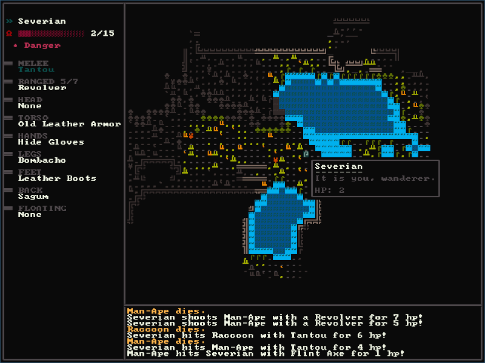

# roguelike
Continuing development of my roguelike game (ON-HOLD).

## TODO
- [ ] Change the ECS library from [specs](https://github.com/amethyst/specs/) to [legion](https://github.com/amethyst/legion).
    - Which basically means changing 60% or so of the existing code...
- [ ] Refactor and improve the map generation system.
    - And also change the spawning system to something that works, and
    - use a different WFC solution.
- [ ] Improve the UI (refactoring + changes).
- [ ] Add dynamic lightning.
- [ ] Fix all bugs up to this point.
- [ ] Add new game content.
